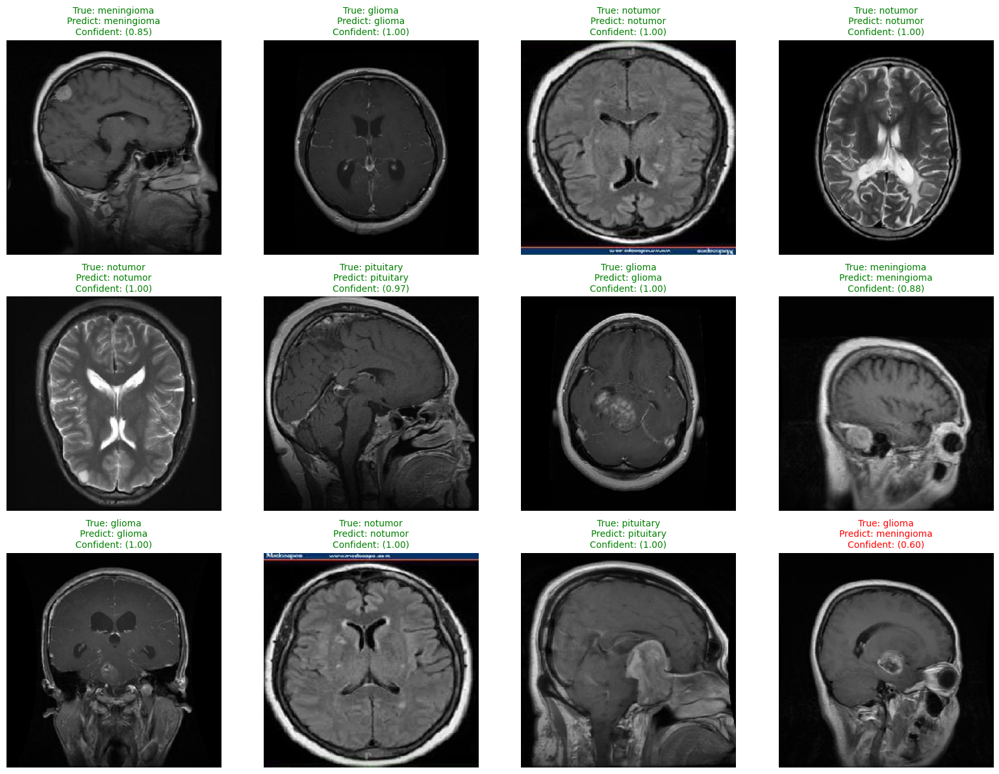

# Brain Tumor Image Classification (CNN vs VGG16)

## Overview
This project compares a **custom CNN trained from scratch** and a **VGG16-based transfer learning model** for **brain tumor MRI image classification**.  
The goal is to analyze the impact of transfer learning and data augmentation on classification performance.

---

## Dataset
- **Source**: Kaggle  
- **Name**: Brain MRI Images for Brain Tumor Detection  
- **Link**: https://www.kaggle.com/datasets/masoudnickparvar/brain-tumor-mri-dataset

Classes:
- Glioma
- Meningioma
- Pituitary
- No Tumor

---

## Models
- **CNN Baseline**  
  Custom convolutional neural network trained from scratch.

- **VGG16 (Transfer Learning)**  
  Pre-trained VGG16 model with a custom classification head and partial fine-tuning.

---

## Training Setup
- Input size: 224 × 224  
- Optimizer: Adam  
- Loss: Categorical Crossentropy  
- Metric: Accuracy  
- Data augmentation applied to improve generalization

---

## Results (Best Model)
The best performance is achieved using **VGG16 with data augmentation**:

- **Accuracy**: **91.23%**
- Improved performance across all tumor classes
- More stable generalization compared to CNN trained from scratch

---

## Sample Prediction
Below is an example of model predictions using the best-performing model (VGG16):

---

## Notes
- Multiple training configurations were tested (with and without data augmentation)
- This project is intended for educational and research purposes only

---# Brain Tumor Image Classification (CNN vs VGG16)

## Overview
This project compares a **custom CNN trained from scratch** and a **VGG16-based transfer learning model** for **brain tumor MRI image classification**.  
The goal is to analyze the impact of transfer learning and data augmentation on classification performance.

---

## Dataset
- **Source**: Kaggle  
- **Name**: Brain MRI Images for Brain Tumor Detection  
- **Link**: https://www.kaggle.com/datasets/masoudnickparvar/brain-tumor-mri-dataset

Classes:
- Glioma
- Meningioma
- Pituitary
- No Tumor

---

## Models
- **CNN Baseline**  
  Custom convolutional neural network trained from scratch.

- **VGG16 (Transfer Learning)**  
  Pre-trained VGG16 model with a custom classification head and partial fine-tuning.

---

## Training Setup
- Input size: 224 × 224  
- Optimizer: Adam  
- Loss: Categorical Crossentropy  
- Metric: Accuracy  
- Data augmentation applied to improve generalization

---

## Results (Best Model)
The best performance is achieved using **VGG16 with data augmentation**:

- **Accuracy**: **91.23%**
- Improved performance across all tumor classes
- More stable generalization compared to CNN trained from scratch

---

## Sample Prediction
Below is an example of model predictions using the best-performing model (VGG16):

---

## Notes
- Multiple training configurations were tested (with and without data augmentation)
- This project is intended for educational and research purposes only

---

